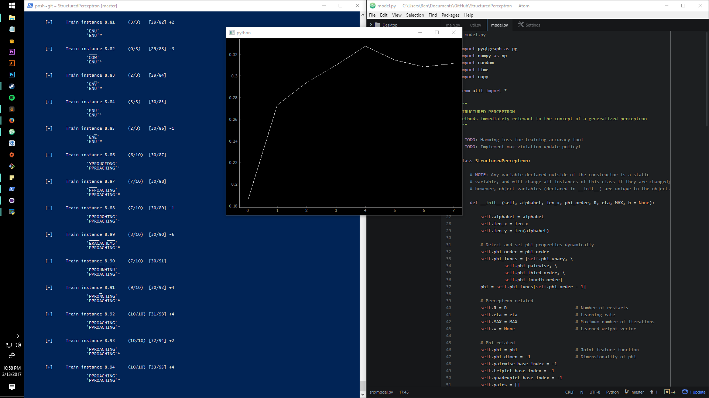

# StructuredPerceptron
Implementation of generalized Perceptron, extended for structured inputs and structured outputs. We now are training on text-to-speech and handwriting data.

### Results
* Handwriting recognition data (OCR): *To be announced*
* Text-to-speech data (Nettalk): *To be announced*

### Model In Action
Running on first-order features with standard update policy

